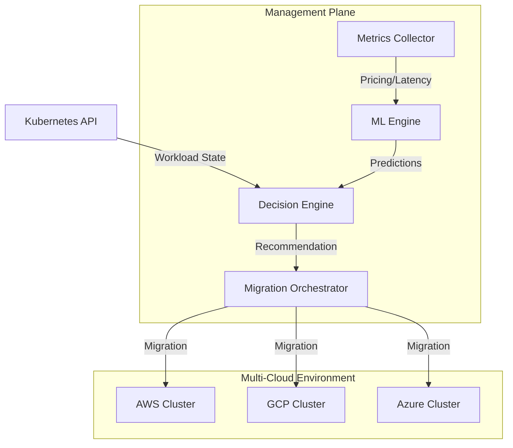

# Guardian: Architectural Deep Dive

## Executive Summary
Guardian is a Kubernetes operator designed for multi-cloud workload placement optimization. It continuously evaluates workload performance and cost across multiple providers (AWS, GCP, Azure) to ensure optimal placement based on user-defined policies.

**Core Principle:** Every workload deserves to run on the cloud where it performs best and costs least.

### Business Value
- Reduces cloud compute costs by 25-40% through intelligent placement.
- Minimizes latency for latency-sensitive applications.
- Automatically rebalances as cloud prices fluctuate.
- Enforces compliance and data residency requirements.
- Enables true multi-cloud without manual optimization.

### Key Metrics
- **Cost Optimization:** Per-workload savings tracking.
- **Placement Accuracy:** Machine Learning model confidence scores.
- **Migration Success:** Zero-downtime migration success rate.
- **Latency Impact:** Before/after measurements.
- **Decision Latency:** Time from cost change to migration decision.

---

## Problem Statement

### The Gap
Organizations run workloads across multiple clouds but lack intelligent placement. Currently, if prices spike or network conditions change, workloads often remain in suboptimal locations for days or weeks until manual intervention occurs.

### The Core Pain
Multi-cloud workloads are placed and kept in suboptimal locations, wasting significant compute spend and potentially violating latency or compliance goals, due to the lack of an automated, data-driven placement engine.

### Pain Points and Impact
| Pain Point | Impact | Current Solution |
|-----------|--------|-----------------|
| Price fluctuation | 25-40% cost waste | Manual monitoring + spreadsheets |
| Latency variation | SLA violations | Static deployment policies |
| Requirement changes | Suboptimal placement | Quarterly capacity reviews |
| Compliance complexity | Data residency violations | Manual policy enforcement |
| Lack of cost visibility | FinOps blind spots | Post-facto cost reporting |
| Manual multi-cloud | Deployment friction | Custom scripts + tribal knowledge |

---

## Competitive Landscape & Positioning

Guardian targets a specific problem: continuous, automated optimization of cloud/region choice for Kubernetes workloads.

### How Guardian Differs from Existing Tools

- **Versus Karpenter / Autoscalers:** Karpenter optimizes node-level capacity *inside* one cloud (intra-cloud bin packing). Guardian decides *which* cloud/region to use (inter-cloud placement). They are complementary.
- **Versus Kubecost / FinOps Dashboards:** These tools provide visibility and recommendations (reporting). Guardian takes action by automating the migration (execution).
- **Versus CAST AI:** CAST AI is a SaaS platform. Guardian is a self-hosted, open-source operator, allowing for data sovereignty and deep customization.

---

## Architecture

### System Overview

Guardian operates as a control plane service within a management cluster, orchestrating workloads across various target clusters.

### Core Components

1.  **Metrics Collector:** Ingests real-time prices (spot, on-demand) from cloud APIs and measures latency from workloads to key dependencies.
2.  **ML Engine:** Uses a Multi-Output Random Forest Regressor to predict cost and latency for all candidate placements.
3.  **Decision Engine:** Evaluates recommendations against `WorkloadPlacementPolicy` CRDs, considering weights for cost vs. latency.
4.  **Migration Orchestrator:** Manages the lifecycle of moving a workload, including pre-flight checks, resource provisioning, state sync, and health verification.

---

## Data Models & CRDs

### WorkloadPlacementPolicy
This CRD defines how a workload should be optimized.
- **Criteria:** Weights for cost, latency, and compliance.
- **Constraints:** Allowed regions/providers and maximum acceptable latency.
- **Migration Policy:** Maintenance windows and strategy (e.g., live migration).

### CloudEnvironment
Defines the connection details and available regions for target cloud providers.

---

## ML Engine Details

The ML Engine serves as a placement oracle.

### Data Pipeline
1.  **Features:** Workload profile (CPU, Mem, Net IO), Cloud profile (current spot rates, regional latency).
2.  **Model:** Training on historical placement outcomes using Gradient Boosting or Random Forest models.
3.  **Inference:** Predicting (cost, latency) pairs for every viable cloud/region combination.

### Model Performance Goals
- Cost Prediction: ±10% Mean Absolute Error.
- Latency Prediction: ±15% Mean Absolute Error.
- Placement Accuracy: >85% optimal decisions.

---

## Monitoring and Observability

Guardian exports critical metrics via Prometheus:
- `guardian_placement_cost_usd`: Estimated cost in current vs. alternative locations.
- `guardian_cost_saved_total`: Cumulative cost reduction.
- `guardian_migrations_completed_total`: Audit trail of placement changes.
- `guardian_ml_prediction_confidence`: Reliability score for recent decisions.

---

## Security Considerations

Guardian follows the principle of least privilege:
- **RBAC:** Scoped to manage only relevant CRDs and the minimum required permissions for workload orchestration (Pod/Node listing).
- **Credential Management:** Cloud credentials are stored as Kubernetes Secrets and accessed securely by the controller.

---

## Conclusion

Guardian bridges the gap between FinOps visibility and DevOps execution, turning multi-cloud sprawl into a continuously optimized, policy-driven infrastructure.
