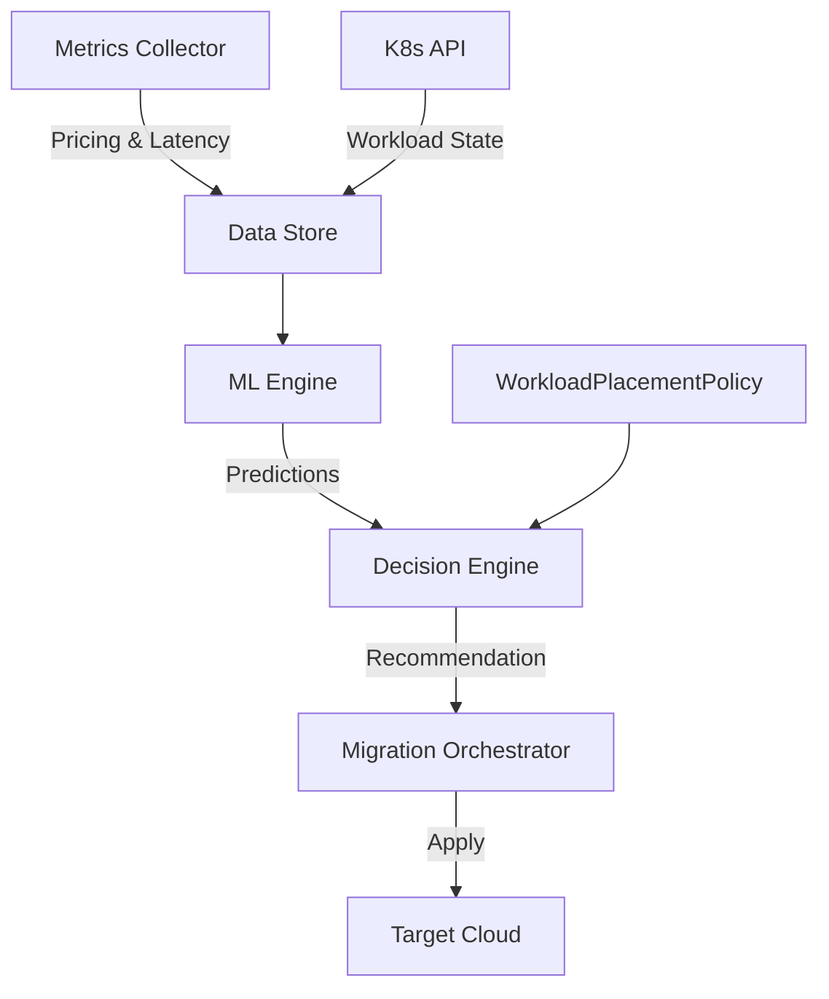

# Guardian: Multi-Cloud Workload Placement Optimizer


**Guardian** is an intelligent Kubernetes operator that continuously optimizes workload placement across multiple cloud providers (AWS, GCP, Azure). It leverages machine learning to predict cost and latency, automatically migrating workloads to the optimal execution environment to minimize spend while guaranteeing SLAs.

## Key Features

- **Multi-Cloud Native**: seamless orchestration across AWS, GCP, and Azure.
- **ML-Driven Decisions**: Uses `scikit-learn` and Random Forest models to predict spot prices and network latency.
- **Policy-as-Code**: Declarative `WorkloadPlacementPolicy` CRDs allow fine-grained controls over compliance and cost/performance trade-offs.
- **Zero-Downtime Migration**: Automated, safe workload migration with traffic shifting and health verification.
- **Observability**: Built-in Prometheus metrics for cost savings and placement accuracy.

## Architecture

Guardian operates as a control plane service within your management cluster.



## Components

| Component | Responsibility | Stack |
|-----------|----------------|-------|
| **Metrics Collector** | Ingests real-time cloud pricing (Spot/On-Demand) and latency metrics. | Python, AsyncIO |
| **ML Engine** | Trains on historical data to forecast future cost and performance. | Scikit-learn, XGBoost |
| **Decision Engine** | Evaluates trade-offs based on user policy (Cost vs. Latency). | Python |
| **Migration Orchestrator** | Executes safe, step-by-step workload migrations. | Kopf, K8s API |

## Installation

### Prerequisites

- Kubernetes Cluster (v1.24+)
- Python 3.11+
- Poetry (for local development)

### Deploying to Kubernetes

1. **Apply CRDs & RBAC**
   ```bash
   kubectl apply -f deploy/crds/
   kubectl apply -f deploy/rbac.yaml
   ```

2. **Deploy the Operator**
   ```bash
   kubectl apply -f deploy/operator.yaml
   ```

3. **Define a Policy**
   ```yaml
   apiVersion: guardian.io/v1alpha1
   kind: WorkloadPlacementPolicy
   metadata:
     name: payment-processor-policy
   spec:
     workloadSelector:
       matchLabels:
         app: payment-processor
     criteria:
       cost:
         weight: 60
         threshold: 0.20 # Migrate if >20% savings
       latency:
         weight: 40
         maxAcceptable: 100
   ```

## Development & Testing

We use `poetry` for dependency management and `pytest` for testing.

```bash
# Install dependencies
make install

# Run unit tests
make test

# Run linter
make lint
```

## Roadmap

- [x] Core Decision Engine
- [x] Multi-Cloud Pricing Ingestion (AWS, Azure, GCP)
- [x] ML Prediction Model
- [x] Real-time Spot Instance Data Feed Integration (AWS & Azure)
- [x] Advanced GitOps Integration (ArgoCD support)

## License

This project is licensed under the MIT License - see the [LICENSE](LICENSE) file for details.

---
*Built by Rajesh Ramesh.*

