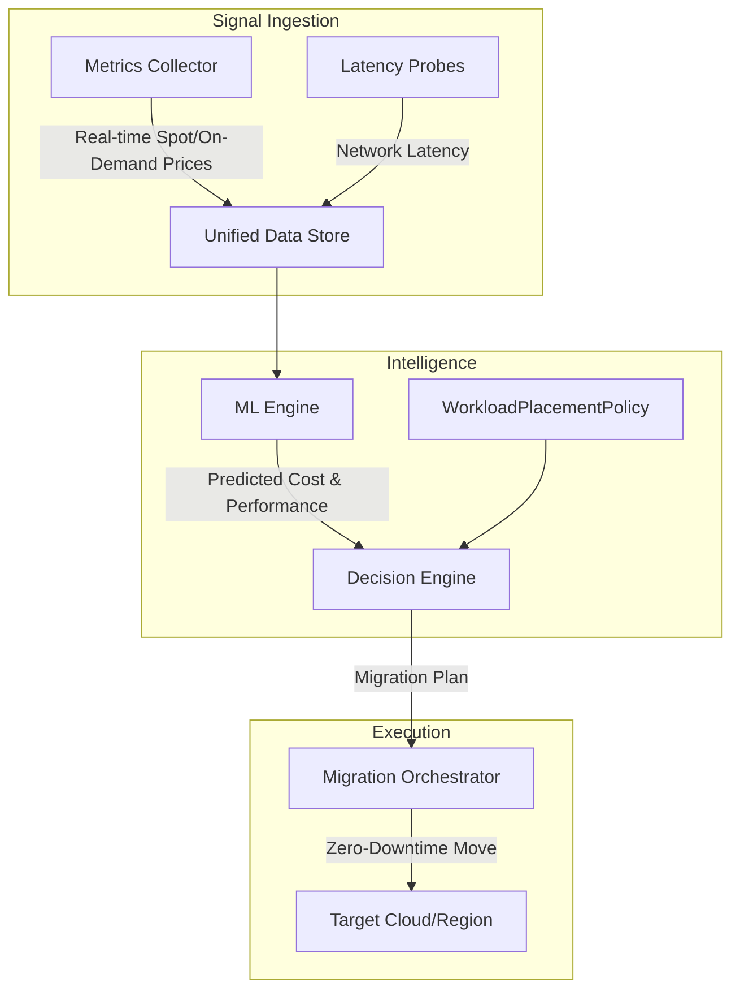

# Guardian: Multi-Cloud Workload Placement Optimizer

Guardian is an intelligent Kubernetes operator that continuously optimizes workload placement across multiple cloud providers (AWS, GCP, Azure). It leverages machine learning to predict cost and performance, automatically migrating workloads to the optimal execution environment.

## The Problem

Organizations today run multi-cloud workloads but lack the intelligence to place them optimally. 

**The scenario:**
- **Monday 10 AM**: AWS spot prices spike 40% in `us-east-1`.
- **Monday 10 AM - Wednesday**: Workloads continue running on AWS, wasting thousands in compute spend.
- **Wednesday 2 PM**: FinOps team notices the spike and manually investigates.
- **Thursday**: Manual migration takes place.

**The Cost**: $10k+ wasted and significant engineering time lost to manual rebalancing.

## The Solution

Guardian treats cloud placement as a continuously optimizable decision. It ingests real-time pricing and performance signals, uses machine learning to predict the best future state, and automates the migration.

- **Automated Savings**: Reduces compute spend by 25-40% through spot instance arbitrage and regional optimization.
- **SLA Protection**: Balances cost savings with latency requirements to ensure performance never suffers.
- **True Multi-Cloud**: Move beyond "multi-cloud visibility" to "multi-cloud execution."

## Quick Start

Get Guardian running in 3 commands:

```bash
# 1. Install CRDs and RBAC
kubectl apply -f deploy/crds/ && kubectl apply -f deploy/rbac.yaml

# 2. Deploy the Operator
kubectl apply -f deploy/operator.yaml

# 3. Apply your first optimization policy
kubectl apply -f examples/cost-optimizer.yaml
```

## Architecture

Guardian operates as a continuous control loop within your cluster.



## Competitive Positioning

| Feature | Guardian | Karpenter | Kubecost | CAST AI |
|---------|----------|-----------|----------|---------|
| **Scope** | Inter-Cloud | Intra-Cloud | Visibility | SaaS Platform |
| **Logic** | ML-Driven | Rule-based | Reporting | Proprietary |
| **Migration** | Zero-downtime | Auto-scaling | Manual | Proprietary |
| **Hosting** | Self-hosted | Self-hosted | Self-hosted | SaaS |

## Roadmap

The Guardian project is currently in its rapid development phase:

- **Weeks 1-2 (MVP)**: Core operator loop, AWS pricing ingestion, simple cost model.
- **Weeks 3-4 (Intelligence)**: GCP/Azure support, Multi-objective optimization (Cost vs Latency).
- **Week 5 (Production)**: Live migration safety checks, automatic rollbacks, and audit trails.

## Contributing

We welcome contributions! Please see our [CONTRIBUTING.md](CONTRIBUTING.md) for details on how to get started.

---
*Built by Rajesh Ramesh.*
